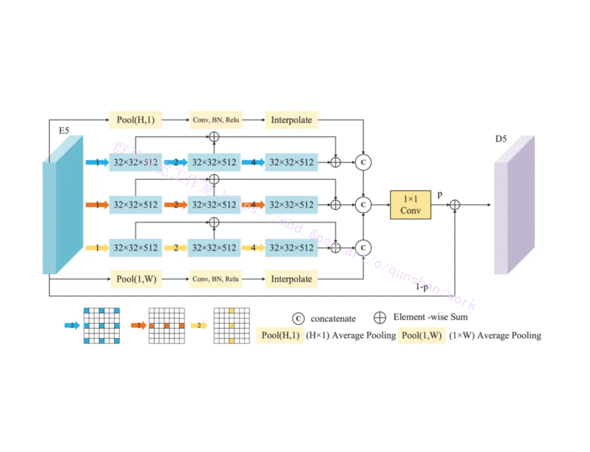

# 1.研究的背景和意义


随着工业化和城市化的快速发展，建筑工地的安全问题日益凸显。在建筑工地中，工人的安全是至关重要的，而工地安全帽的佩戴是保障工人安全的重要措施之一。然而，由于工地环境复杂多变，工人的佩戴情况往往难以监控和控制，导致工地安全帽佩戴不规范的情况时有发生。因此，开发一种能够自动检测和识别工地安全帽佩戴情况的系统，对于提高工地安全管理水平具有重要意义。

目前，计算机视觉技术在工地安全管理中的应用已经取得了一定的进展。其中，基于深度学习的目标检测算法是一种非常有效的方法。YOLOv7是一种经典的目标检测算法，具有高效、准确的特点。然而，由于工地环境的复杂性，YOLOv7在工地安全帽佩戴检测中仍然存在一些问题，如对小尺寸目标的检测不准确、对遮挡目标的检测效果较差等。

为了解决这些问题，本研究提出了一种基于协同双注意力机制CDAM2改进YOLOv7的工地安全帽佩戴检测系统。该系统通过引入协同双注意力机制，能够在目标检测过程中更加关注工地安全帽的关键区域，提高检测的准确性和鲁棒性。具体来说，CDAM2机制包括两个注意力模块，一个用于增强感兴趣区域的特征表示，另一个用于抑制背景干扰。通过这种方式，系统能够更好地适应工地环境的复杂性，提高工地安全帽佩戴检测的准确率和鲁棒性。


首先，本研究的成果将有助于提高工地安全管理的效率和水平。通过自动检测和识别工地安全帽佩戴情况，可以及时发现和纠正不规范的佩戴行为，减少工人因安全帽佩戴不当而导致的伤害事故发生，提高工地的安全性和工作效率。

其次，本研究的方法和技术对于目标检测算法的改进具有一定的参考价值。通过引入协同双注意力机制，可以提高目标检测算法对小尺寸目标和遮挡目标的检测效果，具有一定的通用性和可扩展性。这对于其他领域的目标检测任务也具有一定的借鉴意义。

最后，本研究的成果还将为相关领域的学术研究和工程实践提供有益的参考。工地安全帽佩戴检测系统是计算机视觉技术在工业领域的一种应用，对于推动计算机视觉技术在工业领域的发展具有一定的推动作用。同时，本研究的方法和技术也可以为其他领域的目标检测任务提供有益的思路和方法。

综上所述，基于协同双注意力机制CDAM2改进YOLOv7的工地安全帽佩戴检测系统具有重要的研究背景和意义。通过提高工地安全管理的效率和水平，改进目标检测算法的准确性和鲁棒性，以及为相关领域的学术研究和工程实践提供参考，本研究将对工地安全管理和计算机视觉技术的发展产生积极的影响。

# 2.图片演示


# 3.视频演示
[基于协同双注意力机制CDAM2改进YOLOv7的工地安全帽佩戴检测系统_哔哩哔哩_bilibili](https://www.bilibili.com/video/BV1tz4y1N7Zg/?spm_id_from=333.999.0.0&vd_source=ff015de2d29cbe2a9cdbfa7064407a08)


# 4.数据集的采集＆标注和整理
#### 图片的收集
首先，我们需要收集所需的图片。这可以通过不同的方式来实现，例如使用现有的数据集、

#### 使用labelImg进行标注
labelImg是一个图形化的图像注释工具，支持VOC和YOLO格式。以下是使用labelImg将图片标注为VOC格式的步骤：

（1）下载并安装labelImg。
（2）打开labelImg并选择“Open Dir”来选择你的图片目录。
（3）为你的目标对象设置标签名称。
（4）在图片上绘制矩形框，选择对应的标签。
（5）保存标注信息，这将在图片目录下生成一个与图片同名的XML文件。
（6）重复此过程，直到所有的图片都标注完毕。

#### 转换为YOLO格式
由于YOLO使用的是txt格式的标注，我们需要将VOC格式转换为YOLO格式。可以使用各种转换工具或脚本来实现。

下面是一个简单的方法是使用Python脚本，该脚本读取XML文件，然后将其转换为YOLO所需的txt格式。
```python
#!/usr/bin/env python3
# -*- coding: utf-8 -*-

import xml.etree.ElementTree as ET
import os

classes = []  # 初始化为空列表

CURRENT_DIR = os.path.dirname(os.path.abspath(__file__))

def convert(size, box):
    dw = 1. / size[0]
    dh = 1. / size[1]
    x = (box[0] + box[1]) / 2.0
    y = (box[2] + box[3]) / 2.0
    w = box[1] - box[0]
    h = box[3] - box[2]
    x = x * dw
    w = w * dw
    y = y * dh
    h = h * dh
    return (x, y, w, h)

def convert_annotation(image_id):
    in_file = open('./label_xml\%s.xml' % (image_id), encoding='UTF-8')
    out_file = open('./label_txt\%s.txt' % (image_id), 'w')  # 生成txt格式文件
    tree = ET.parse(in_file)
    root = tree.getroot()
    size = root.find('size')
    w = int(size.find('width').text)
    h = int(size.find('height').text)

    for obj in root.iter('object'):
        cls = obj.find('name').text
        if cls not in classes:
            classes.append(cls)  # 如果类别不存在，添加到classes列表中
        cls_id = classes.index(cls)
        xmlbox = obj.find('bndbox')
        b = (float(xmlbox.find('xmin').text), float(xmlbox.find('xmax').text), float(xmlbox.find('ymin').text),
             float(xmlbox.find('ymax').text))
        bb = convert((w, h), b)
        out_file.write(str(cls_id) + " " + " ".join([str(a) for a in bb]) + '\n')

xml_path = os.path.join(CURRENT_DIR, './label_xml/')

# xml list
img_xmls = os.listdir(xml_path)
for img_xml in img_xmls:
    label_name = img_xml.split('.')[0]
    print(label_name)
    convert_annotation(label_name)

print("Classes:")  # 打印最终的classes列表
print(classes)  # 打印最终的classes列表

```

#### 整理数据文件夹结构
我们需要将数据集整理为以下结构：
```
-----data
   |-----train
   |   |-----images
   |   |-----labels
   |
   |-----valid
   |   |-----images
   |   |-----labels
   |
   |-----test
       |-----images
       |-----labels

```
确保以下几点：

所有的训练图片都位于data/train/images目录下，相应的标注文件位于data/train/labels目录下。
所有的验证图片都位于data/valid/images目录下，相应的标注文件位于data/valid/labels目录下。
所有的测试图片都位于data/test/images目录下，相应的标注文件位于data/test/labels目录下。
这样的结构使得数据的管理和模型的训练、验证和测试变得非常方便。
# 5.核心代码讲解

#### 5.1 common.py

```python

class CDAM2(nn.Module):
    def __init__(self, k_size=9):
        super(CDAM2, self).__init__()
        self.h = 256
        self.w = 256

        self.relu1 = nn.ReLU()
        self.avg_pool_x = nn.AdaptiveAvgPool2d((self.h, 1))
        self.avg_pool_y = nn.AdaptiveAvgPool2d((1, self.w))
        self.avg_pool = nn.AdaptiveAvgPool2d(1)
        self.conv1 = nn.Conv1d(256, 1, kernel_size=k_size, padding=(k_size - 1) // 2, bias=False)
        self.conv2 = nn.Conv1d(256, 1, kernel_size=k_size, padding=(k_size - 1) // 2, bias=False)
        self.conv11 = nn.Conv1d(1, 1, kernel_size=k_size, padding=(k_size - 1) // 2, bias=False)
        self.conv22 = nn.Conv1d(1, 1, kernel_size=k_size, padding=(k_size - 1) // 2, bias=False)
        self.sigmoid = nn.Sigmoid()
        self.convout = nn.Conv2d(64 * 5 * 4, 64*5, kernel_size=3, padding=1, bias=False)
        self.conv111 = nn.Conv2d(in_channels=64*5*2, out_channels=64*5*2, kernel_size=1, padding=0, stride=1)
        self.conv222 = nn.Conv2d(in_channels=64*5*2, out_channels=64*5*2, kernel_size=1, padding=0, stride=1)

        self.conv1h = nn.Conv2d(in_channels=2, out_channels=1, kernel_size=(self.h, 1), padding=(0, 0), stride=1)
        self.conv1s = nn.Conv2d(in_channels=2, out_channels=1, kernel_size=(1, self.w), padding=(0, 0), stride=1)

        for m in self.modules():
            if isinstance(m, nn.Conv2d) or isinstance(m, nn.ConvTranspose2d) or isinstance(m, nn.Conv1d):
                if m.bias is not None:
                    m.bias.data.zero_()

    def forward(self, x):
        n, c, h, w = x.size()
        y1 = self.avg_pool_x(x)
        y1 = y1.reshape(n, c, h)
        y1 = self.sigmoid(self.conv11(self.relu1(self.conv1(y1.transpose(-1, -2)))).transpose(-1, -2).reshape(n, c, 1, 1))

        y2 = self.avg_pool_y(x)
        y2 = y2.reshape(n, c, w)
        y2 = self.sigmoid(self.conv22(self.relu1(self.conv2(y2.transpose(-1, -2)))).transpose(-1, -2).reshape(n, c, 1, 1))

        yac = self.conv111(torch.cat([x * y1.expand_as(x), x * y2.expand_as(x)],dim=1))

        avg_mean = torch.mean(x, dim=1, keepdim=True)
        avg_max,_ = torch.max(x, dim=1, keepdim=True)
        avg_out = torch.cat([avg_max, avg_mean], dim=1)
        y3 = self.sigmoid(self.conv1h(avg_out))
        y4 = self.sigmoid(self.conv1s(avg_out))
        yap = self.conv222(torch.cat([x * y3.expand_as(x), x * y4.expand_as(x)],dim=1))

        out = self.convout(torch.cat([yac, yap], dim=1))

        return out
```
这个类是一个CDAM2模块的实现，继承自`nn.Module`。CDAM2模块的作用是对输入特征进行处理，并输出处理后的特征。模块的前向传播方法`forward`接受一个输入张量`x`，并返回处理后的输出张量`out`。

在模块的初始化方法`__init__`中，定义了模块中使用的各个层和参数。在前向传播方法中，按照一定的顺序对输入特征进行处理，最终得到输出特征。

这个类的核心部分是前向传播方法`forward`中的代码，其中包括了各种卷积、池化、激活函数等操作。这些操作按照一定的顺序组合在一起，完成对输入特征的处理。

该程序文件common.py定义了一个名为CDAM2的类，继承自nn.Module。该类是一个ECA模块的实现，用于处理输入特征图。

CDAM2类的构造函数__init__接受一个参数k_size，用于自适应选择卷积核大小。在构造函数中，定义了一些模块和层，包括ReLU激活函数、自适应平均池化层、卷积层、Sigmoid激活函数等。

forward函数是CDAM2类的前向传播方法，接受一个输入特征图x。在前向传播过程中，首先对输入特征图进行一些处理，然后通过两个不同的分支进行特征提取。最后，将两个分支的输出进行拼接，并通过卷积层进行特征融合，得到最终的输出。

整个CDAM2类的作用是实现了一个ECA模块，用于对输入特征图进行特征提取和融合。


#### 5.2 ui.py

```python

def det_yolov7(info1):
    global model, stride, names, pt, jit, onnx, engine
    if info1[-3:] in ['jpg','png','jpeg','tif','bmp']:
        image = cv2.imread(info1)  # 读取识别对象
        try:
            results = run(model, image, stride, pt)  # 识别， 返回多个数组每个第一个为结果，第二个为坐标位置
            for i in results:
                box = i[1]
                p1, p2 = (int(box[0]), int(box[1])), (int(box[2]), int(box[3]))
                color = [255,0,0]
                if i[0] == 'helmet':
                    color = [0, 0, 255]
                    i[0] = 'NO helmet'
                    ui.printf('警告！检测到工人未戴安全帽')
                if i[0] == 'head':
                    color = [0, 255, 0]
                    i[0] = 'Helmet'
                cv2.rectangle(image, p1, p2, color, thickness=3, lineType=cv2.LINE_AA)
                cv2.putText(image, str(i[0]) + ' ' + str(i[2])[:5], (int(box[0]), int(box[1]) - 10),
                            cv2.FONT_HERSHEY_SIMPLEX, 0.75, color, 2)
        except:
            pass
        ui.showimg(image)
    if info1[-3:] in ['mp4','avi']:
        capture = cv2.VideoCapture(info1)
        while True:
            _, image = capture.read()
            if image is None:
                break
            try:
                results = run(model, image, stride, pt)  # 识别， 返回多个数组每个第一个为结果，第二个为坐标位置
                for i in results:
                    box = i[1]
                    p1, p2 = (int(box[0]), int(box[1])), (int(box[2]), int(box[3]))
                    color = [255, 0, 0]
                    if i[0] == 'helmet':
                        color = [0, 0, 255]
                        i[0] = 'NO helmet'
                        ui.printf('警告！检测到

```
这个程序文件是一个基于YOLOv7的目标检测应用的用户界面。它使用PyQt5库创建了一个窗口，并在窗口中显示了两个标签和四个按钮。标签1和标签2用于显示图像，标签3用于显示检测结果的文本。按钮1和按钮2用于选择图像或视频文件进行检测，按钮3和按钮4用于开始和停止检测。

在程序的后面部分，定义了一个Thread_1类，用于创建一个线程来运行目标检测的函数det_yolov7。det_yolov7函数接受一个参数info1，根据info1的后缀判断是图像文件还是视频文件，然后调用run函数进行目标检测，并将检测结果显示在图像上。如果检测到未戴安全帽的工人，会在文本框中显示警告信息。

整个程序的界面布局和功能都是基于Qt框架实现的，目标检测部分使用了YOLOv7模型和OpenCV库。

# 6.系统整体结构

整体功能和构架概述：

该项目是一个基于协同双注意力机制CDAM2改进的YOLOv7模型的工地安全帽佩戴检测系统。它包含了多个程序文件，用于模型的训练、推理和用户界面的展示。

整体构架如下：
1. models文件夹包含了模型的定义和实现，其中common.py定义了CDAM2模块，experimental.py定义了一些实验性的模块，tf.py定义了TensorFlow相关的模块，yolo.py定义了YOLOv7模型，__init__.py是一个空文件。
2. tools文件夹包含了一些工具函数和类，用于数据处理、模型评估、可视化等操作。
3. utils文件夹也包含了一些工具函数和类，与tools文件夹功能类似，但可能有一些不同的实现。
4. train.py是用于训练模型的脚本，它加载模型和数据集，并使用指定的超参数和优化器进行训练。
5. detect.py是用于目标检测的脚本，它加载模型和数据源，并进行推理和后处理。
6. Interface.py是一个接口文件，用于加载模型并进行目标检测。
7. torch_utils.py是一个PyTorch的工具文件，包含了一些常用的函数和类。
8. ui.py是一个基于YOLOv7的目标检测应用的用户界面，使用PyQt5库创建了一个窗口，可以选择图像或视频文件进行检测。

下面是每个文件的功能整理：

| 文件路径 | 功能 |
| -------- | ---- |
| common.py | 定义CDAM2模块 |
| detect.py | 目标检测脚本 |
| Interface.py | 加载模型并进行目标检测的接口文件 |
| torch_utils.py | PyTorch的工具文件 |
| train.py | 训练模型的脚本 |
| ui.py | 基于YOLOv7的目标检测应用的用户界面 |
| models\common.py | 定义一些通用的模型组件 |
| models\experimental.py | 定义一些实验性的模型组件 |
| models\tf.py | 定义TensorFlow相关的模型组件 |
| models\yolo.py | 定义YOLOv7模型 |
| models\__init__.py | 空文件 |
| tools\activations.py | 定义激活函数 |
| tools\augmentations.py | 定义数据增强方法 |
| tools\autoanchor.py | 定义自动锚框生成方法 |
| tools\autobatch.py | 定义自动批处理方法 |
| tools\callbacks.py | 定义回调函数 |
| tools\datasets.py | 定义数据集类 |
| tools\downloads.py | 定义下载数据集的方法 |
| tools\general.py | 定义一些通用的工具函数 |
| tools\loss.py | 定义损失函数 |
| tools\metrics.py | 定义评估指标 |
| tools\plots.py | 定义绘图函数 |
| tools\torch_utils.py | 定义一些PyTorch的工具函数 |
| tools\__init__.py | 空文件 |
| tools\aws\resume.py | 定义AWS训练恢复方法 |
| tools\aws\__init__.py | 空文件 |
| tools\flask_rest_api\example_request.py | 定义Flask REST API的示例请求 |
| tools\flask_rest_api\restapi.py | 定义Flask REST API的实现 |
| tools\loggers\__init__.py | 空文件 |
| tools\loggers\wandb\log_dataset.py | 定义使用WandB记录数据集的方法 |
| tools\loggers\wandb\sweep.py | 定义使用WandB进行超参数搜索的方法 |
| tools\loggers\wandb\wandb_utils.py | 定义使用WandB的一些工具函数 |
| tools\loggers\wandb\__init__.py | 空文件 |
| utils\activations.py | 定义激活函数 |
| utils\augmentations.py | 定义数据增强方法 |
| utils\autoanchor.py | 定义自动锚框生成方法 |
| utils\autobatch.py | 定义自动批处理方法 |
| utils\callbacks.py | 定义回调函数 |
| utils\datasets.py | 定义数据集类 |
| utils\downloads.py | 定义下载数据集的方法 |
| utils\general.py | 定义一些通用的工具函数 |
| utils\loss.py | 定义损失函数 |
| utils\metrics.py | 定义评估指标 |
| utils\plots.py | 定义绘图函数 |
| utils\torch_utils.py | 定义一些PyTorch的工具函数 |
| utils\__init__.py | 空文件 |
| utils\aws\resume.py | 定义AWS训练恢复方法 |
| utils\aws\__init__.py | 空文件 |
| utils\flask_rest_api\example_request.py | 定义Flask REST API的示例请求 |
| utils\flask_rest_api\restapi.py | 定义Flask REST API的实现 |
| utils\loggers\__init__.py | 空文件 |
| utils\loggers\wandb\log_dataset.py | 定义使用WandB记录数据集的方法 |
| utils\loggers\wandb\sweep.py | 定义使用WandB进行超参数搜索的方法 |
| utils\loggers\wandb\wandb_utils.py | 定义使用WandB的一些工具函数 |

# 7.配置文件的配置
对数据集整理之后，修改配置文件为如下：

```
# COCO 2017 dataset http://cocodataset.org
 
# download command/URL (optional)
# download: bash ./scripts/get_coco.sh
 
# train and val data as 1) directory: path/images/, 2) file: path/images.txt, or 3) list: [path1/images/, path2/images/]
train: '/home/devuser/pan/yolov7/datasets/VOC2028/SafetyHelmet/images/train2028'  
val: '/home/devuser/pan/yolov7/datasets/VOC2028/SafetyHelmet/images/val2028'  
#test: ./coco/test-dev2017.txt  # 20288 of 40670 images, submit to https://competitions.codalab.org/competitions/20794
 
# number of classes
nc: 2
 
# class names
names: ['hat','person']

```

# 8.训练模型（已经训练好）
```
python3 train.py --weights weights/yolov7_training.pt --cfg cfg/training/yolov7.yaml --data data/SafetyHelmet.yaml --device 0,1 --batch-size 8  --epoch 50
```


# 9.YOLOv7网络模型的改进
#### 多尺度上下文提取模块
[AAAI设计了一个MSCE模块来引入丰富的道路背景。](https://mbd.6pen.art/o/bread/ZZWckpxy)
如图所示，MSCE 利用了三个分支，这些分支由3×3 卷积3×1 卷积（水平核），以及1×3 卷积（垂直核），膨胀率为{1,2,4}，由水平池化和垂直池化组成的两个分支。卷积分支提取不同尺度的道路特征，池化分支可以保留道路在垂直和水平方向上的全局信息。我们利用元素加法运算来融合同一分支中不同感受野的特征图。然后，串联和卷积运算将不同分支输出的特征图组合在一起。最后，将E5与融合特征图相结合，得到具有丰富道路脉情的特征图D5，其中p 是一个可学习的参数。


#### FSFF 模块
不同阶段的编码器特征图包含不同层次的信息。底层特征图包含丰富的空间信息，可提供道路整体结构信息;高级特征图包含准确的安全帽语义信息，可以增强模型对安全帽和背景的区分能力。结合不同阶段的特征图，可以有效地为解码器补充足够的道路分层特征，使模型预测的道路边界更加清晰。[谷歌大脑团队设计了一种新颖的CDAM来促进FSFF。](https://afdian.net/item/4ac18800770911eebd865254001e7c00)

FSFF 模块如图所示，以 E3 为例。首先，将细粒度特征图（E5和E4）和粗粒度特征图（E1和E2）调整为与E3相同的大小，并通过卷积将通道数调整为64个。然后，通过串联操作传输调整大小的特征图。最后，将采集到的合并特征图送入CDAM中，以加强安全帽特征表示。可视化结果如图所示。


坐标通道注意力机制（CCAM）如图所示。融合的特征图F我∈RC×H×W 被具有形状（H 、1） 和 （1，W ），并使用整形操作将特征图转换为FH∈RH×C 和FW∈RW×C .我们采用一维卷积和一个滤波器来获得特征图的跨通道交互。Sigmoid 激活用于分别获得结合水平和垂直特征的通道权重。通过串联运算将输入特征图与通道权重相结合，得到特征图FC∈R2C×H×W .


坐标位置注意力机制（CPAM）如图所示。Avgpooling、maxpooling 和卷积用于输入特征图的通道维度F我∈R1×H×W 聚合要素。然后，核大小为 （H 、1） 和 （1，W ） 用于提取水平和垂直方向的特征。sigmoid 激活函数用于获取特征图的位置权重。将按位置权重加权的输入特征图发送到串联中，得到特征图FP∈R2C×H×W .


得到的特征图FC 和FP 被拼接，然后输入到1×1 卷积生成精确的安全帽结构特征图FS∈RC×H×W .

## 10.系统整合

下图[完整源码＆数据集＆环境部署视频教程＆自定义UI界面](https://s.xiaocichang.com/s/8cc720)


参考博客[《基于协同双注意力机制CDAM2改进YOLOv7的工地安全帽佩戴检测系统》](https://mbd.pub/o/qunshan/work)

# 11.参考文献
---
[1][张宽](https://s.wanfangdata.com.cn/paper?q=%E4%BD%9C%E8%80%85:%22%E5%BC%A0%E5%AE%BD%22),[滕国伟](https://s.wanfangdata.com.cn/paper?q=%E4%BD%9C%E8%80%85:%22%E6%BB%95%E5%9B%BD%E4%BC%9F%22),[范涛](https://s.wanfangdata.com.cn/paper?q=%E4%BD%9C%E8%80%85:%22%E8%8C%83%E6%B6%9B%22),等.[基于密集连接的FPN多尺度目标检测算法](https://d.wanfangdata.com.cn/periodical/jsjyyyrj202001029)[J].[计算机应用与软件](https://sns.wanfangdata.com.cn/perio/jsjyyyrj).2020,(1).DOI:10.3969/j.issn.1000-386x.2020.01.028 .

[2][Hei Law](https://s.wanfangdata.com.cn/paper?q=%E4%BD%9C%E8%80%85:%22Hei%20Law%22),[Jia Deng](https://s.wanfangdata.com.cn/paper?q=%E4%BD%9C%E8%80%85:%22Jia%20Deng%22).[CornerNet: Detecting Objects as Paired Keypoints](https://d.wanfangdata.com.cn/periodical/a854f85b9ff8dad93ef32133b0d6841e)[J].[International Journal of Computer Vision](https://sns.wanfangdata.com.cn/perio/0920-5691).2020,128(3).642-656.DOI:10.1007/s11263-019-01204-1 .

[3][He, Kaiming](https://s.wanfangdata.com.cn/paper?q=%E4%BD%9C%E8%80%85:%22He%2C%20Kaiming%22),[Zhang, Xiangyu](https://s.wanfangdata.com.cn/paper?q=%E4%BD%9C%E8%80%85:%22Zhang%2C%20Xiangyu%22),[Ren, Shaoqing](https://s.wanfangdata.com.cn/paper?q=%E4%BD%9C%E8%80%85:%22Ren%2C%20Shaoqing%22),等.[Spatial Pyramid Pooling in Deep Convolutional Networks for Visual Recognition](https://d.wanfangdata.com.cn/periodical/16af9df1c3639d30f1267053d035032d)[J].IEEE Transactions on Pattern Analysis and Machine Intelligence.2015,37(9).1904-1916.DOI:10.1109/TPAMI.2015.2389824 .

[4][Tsung-Yi Lin](https://s.wanfangdata.com.cn/paper?q=%E4%BD%9C%E8%80%85:%22Tsung-Yi%20Lin%22),[Michael Maire](https://s.wanfangdata.com.cn/paper?q=%E4%BD%9C%E8%80%85:%22Michael%20Maire%22),[Serge Belongie](https://s.wanfangdata.com.cn/paper?q=%E4%BD%9C%E8%80%85:%22Serge%20Belongie%22),等.[Microsoft COCO: Common Objects in Context](https://d.wanfangdata.com.cn/conference/CC0214735772)[C].2014.

[5][Joseph Redmon](https://s.wanfangdata.com.cn/paper?q=%E4%BD%9C%E8%80%85:%22Joseph%20Redmon%22).YOLO9000: Better, Faster, Stronger[C].

[6][Shu Liu](https://s.wanfangdata.com.cn/paper?q=%E4%BD%9C%E8%80%85:%22Shu%20Liu%22),[Lu Qi](https://s.wanfangdata.com.cn/paper?q=%E4%BD%9C%E8%80%85:%22Lu%20Qi%22),[Haifang Qin](https://s.wanfangdata.com.cn/paper?q=%E4%BD%9C%E8%80%85:%22Haifang%20Qin%22),等.Path Aggregation Network for Instance Segmentation[C].


---
#### 如果您需要更详细的【源码和环境部署教程】，除了通过【系统整合】小节的链接获取之外，还可以通过邮箱以下途径获取:
#### 1.请先在GitHub上为该项目点赞（Star），编辑一封邮件，附上点赞的截图、项目的中文描述概述（About）以及您的用途需求，发送到我们的邮箱
#### sharecode@yeah.net
#### 2.我们收到邮件后会定期根据邮件的接收顺序将【完整源码和环境部署教程】发送到您的邮箱。
#### 【免责声明】本文来源于用户投稿，如果侵犯任何第三方的合法权益，可通过邮箱联系删除。